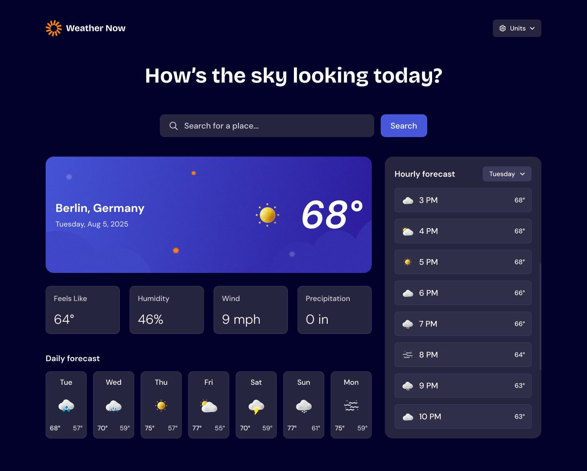

# Frontend Mentor - Weather app solution

This is a solution to the [Weather app challenge on Frontend Mentor](https://www.frontendmentor.io/challenges/weather-app-K1FhddVm49). Frontend Mentor challenges help you improve your coding skills by building realistic projects.

## Table of contents

- [Overview](#overview)
  - [The challenge](#the-challenge)
  - [Screenshot](#screenshot)
  - [Links](#links)
- [My process](#my-process)
  - [Built with](#built-with)
  - [What I learned](#what-i-learned)
  - [Continued development](#continued-development)
- [Author](#author)
- [Acknowledgments](#acknowledgments)

**Note: Delete this note and update the table of contents based on what sections you keep.**

## Overview

### The challenge

Users should be able to:

- Search for weather information by entering a location in the search bar
- View current weather conditions including temperature, weather icon, and location details
- See additional weather metrics like "feels like" temperature, humidity percentage, wind speed, and precipitation amounts
- Browse a 7-day weather forecast with daily high/low temperatures and weather icons
- View an hourly forecast showing temperature changes throughout the day
- Switch between different days of the week using the day selector in the hourly forecast section
- Toggle between Imperial and Metric measurement units via the units dropdown
- Switch between specific temperature units (Celsius and Fahrenheit) and measurement units for wind speed (km/h and mph) and precipitation (millimeters) via the units dropdown
- View the optimal layout for the interface depending on their device's screen size
- See hover and focus states for all interactive elements on the page

### Screenshot

### Links

- Solution URL: (https://github.com/aviciinvestment/frontendmentors1)
- Live Site URL: (https://myweatherapp2.vercel.app/)

## My process

I made a wireframe of the app and then I started building it using React. I used tailwind css for styling and CSS custom properties for theming. I also used Flexbox and CSS Grid for layout. I made sure to use mobile-first workflow and I used React hooks for state management.

### Built with

- Semantic HTML5 markup
- CSS custom properties
- Flexbox
- CSS Grid
- Mobile-first workflow
- [React](https://reactjs.org/) - JS library
- [Tailwind CSS](https://tailwind.com/) - For styles

### What I learned

- How to use React hooks for state management
- How to use CSS custom properties for theming
- How to use Flexbox and CSS Grid for layout
- How to use mobile-first workflow
- How to use Semantic HTML5 markup

### Continued development

i will like to add more features to the app such as a voice assistant function and a way to integrate Ai for smart decision to users.
i interacted with various react state managements and i will look into more of them to see which one is best for my app.

## Author

- Frontend Mentor - (https://www.frontendmentor.io/profile/aviciinvestment)
- Twitter - (https://www.twitter.com/aviciinvestment)

## Acknowledgments

- [Message Akunna](https://www.twitter.com/messageakunna) - for the design inspiration, and His thorough guidiance and support through out the whole process.
- [Frontend Mentor](https://www.frontendmentor.io) - for the challenge and for providing the design files.
- [Tailwind CSS](https://tailwindcss.com/) - for the CSS framework.
- [React](https://reactjs.org/) - for the JavaScript library.
